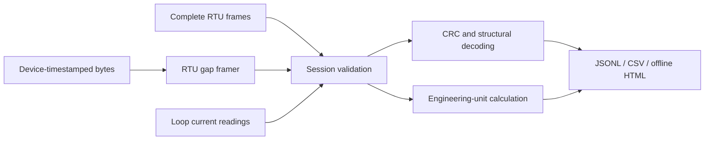

# Architecture

Pocket Field Debugger operates locally. The software accepts portable capture files; it does not depend on a maintenance-management application or server.

## Modules

| Module | Responsibility |
| --- | --- |
| `modbus.py` | CRC, frame interpretation, serial timing, byte framing |
| `loop.py` | Engineering range scaling and voltage/shunt conversion |
| `session.py` | Versioned input validation, analysis, summary, and CSV |
| `report.py` / `report.html` | Self-contained report rendering and local interactive controls |
| `demo.py` | Deterministic simulated fixtures |
| `__main__.py` | CLI commands and clean error reporting |

Input order is preserved. Sessions can contain multiple session IDs; deduplication uses `(session_id, record_id)`. The source timestamp and provenance remain part of each record. The plot uses loop-record order rather than implying uniformly timed sampling.

Raw frame candidates are retained separately from the final inferred role. A candidate is a possible structural interpretation, not proof that the frame was received or executed. Any detected integrity, address, structure, or timing issue leaves the role unknown. Some valid frames admit both request and response interpretations and remain ambiguous.

No transaction correlator is implemented yet. Consequently the software makes no missing-response or latency claims. A future correlator must handle missing capture segments, broadcasts, exceptions, repeated identical writes, and response quantities inconsistent with requests.

## Future acquisition boundary

The handheld MCU should timestamp UART byte completion using its timer and emit bounded records over USB. Firmware must provide capture-start/stop and overflow flags; laptop receipt timestamps cannot reconstruct wire gaps reliably.

The loop path will add raw ADC counts, shunt/reference configuration, calibration provenance, and electrical mode. Software scaling can operate on those measured currents once the hardware converts them appropriately. Calibration fitting, uncertainty evaluation, DAC output control, and the output-enable state machine remain unimplemented.

The report embeds escaped JSON and renders user-provided strings using `textContent`. CSV export neutralizes formula-like text fields. These measures protect ordinary file viewing; they do not establish provenance or validate the physical instrument.
