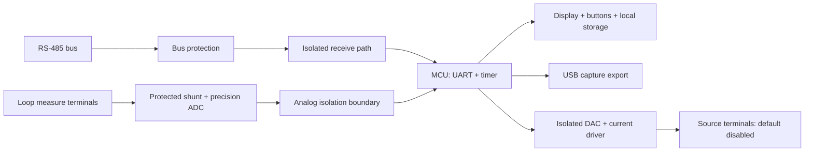

# Hardware development plan

Status: requirements and proposed architecture. There is no fabrication-ready schematic, PCB, firmware target, or validated BOM in v0.1. No parts need to be purchased to use the software.

## Target behavior

The handheld tool should provide independent receive-only RS-485 capture and deliberately selected current measure/source modes. Start with bench-only, low-voltage DC loops. Establish the supported terminal voltage, current, loading, environmental range, and protection behavior through design and testing rather than assuming industrial certification.

The arrows express function, not wiring. Each isolation boundary requires an appropriate power-domain design; an isolated transceiver without isolated bus-side power does not isolate the whole tool. USB grounding and the relationship between analog and RS-485 domains must be addressed explicitly.

## Tentative BOM categories

| Subsystem | Selection requirements |
| --- | --- |
| Controller | Development board with UART, hardware timer, USB export path, and sufficient capture buffering; an STM32 is a candidate |
| RS-485 receive path | Protected isolated interface, hardware-disabled transmitter, and documented bus loading |
| Bus-side supply | Isolated DC/DC appropriate to the interface and verified isolation design |
| Current measurement | External precision ADC, reference, stable shunt, input protection, and defined burden voltage |
| Current source | DAC, precision reference, controlled current driver, output-voltage sensing, current limit, and hardware enable |
| Operator controls | Small display and explicit mode selection with a separate source-enable action |
| Power and enclosure | Regulated bench power first; battery/charging and enclosure after circuit verification |

Component examples for study: [TI ISO1410](https://www.ti.com/product/ISO1410) for isolated RS-485 and [TI DAC161S997](https://www.ti.com/product/DAC161S997) for a loop-output reference. These are study references, not a ready-to-order BOM. A transmitter DAC does not automatically implement measure, powered source, or externally powered transmitter-simulation modes.

## Receive-only constraints

- Keep the RS-485 driver-enable signal held inactive in hardware during reset, boot, and operation. Do not rely solely on application code not calling a write function.
- Add neither termination nor bias by default to an already operating bus. Document optional termination for a separate bench setup.
- Include the correct signal-common connection and verify common-mode limits. A/B labeling varies between vendors; document the tested wiring convention.
- Timestamp bytes at the MCU and report lost data. Confirm loading and traffic remain acceptable with the tool attached.

## Loop modes

**Measure:** A series shunt requires opening/inserting into the loop and adds burden voltage. As a calculation example, 25 ohms produces 100-500 mV over 4-20 mA; the final shunt and ADC range must be selected from accuracy, input protection, and compliance requirements. The software helper calculates mA from mV/ohms; it does not compensate hardware errors.

**Powered source:** Provide controlled current into an explicitly specified passive load. Output defaults disabled and requires an explicit operator enable after selecting the mode. Open-load behavior, compliance limits, reversed polarity, and current limiting must be tested. Preset targets are 4, 8, 12, 16, and 20 mA.

**Externally powered transmitter simulation:** This is a separate controlled-sink architecture and belongs to a later milestone. It must not be presented as the same circuit as a powered source.

## Firmware behavior to implement

States: `OUTPUT_OFF`, `MEASURE`, `SOURCE_ARMED`, `SOURCE_ACTIVE`, and `FAULT`. Reset, watchdog expiry, mode change, and fault transition to output off. The sniffer remains receive-only in all states. Calibration and configuration records need versioning and CRC/checksum protection.

Board choice, pin mapping, schematics, firmware implementation, and quantitative accuracy targets will follow bench component evaluation. Publish measured error and uncertainty before applying the word calibrated to the hardware release.
